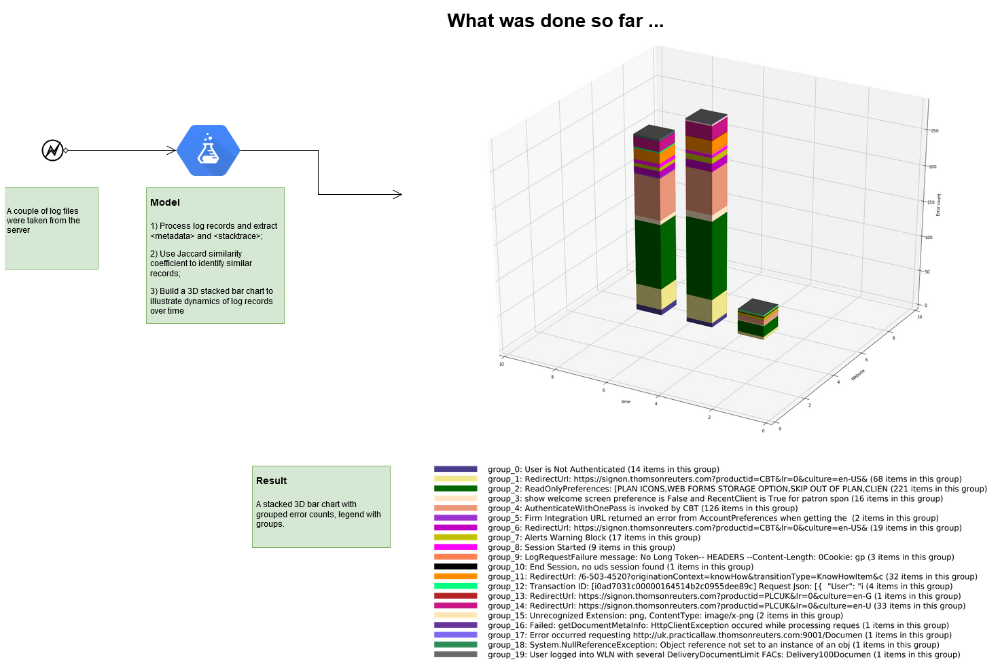
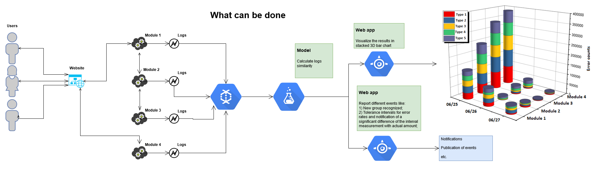

# west_logs

This is an attempt to group related log records using [Jaccard similarity coefficient](https://en.wikipedia.org/wiki/Jaccard_index#Generalized_Jaccard_similarity_and_distance).

Inspiration was taken from:
* [Weighted MinHash on GPU helps to find duplicate GitHub repositories](https://blog.sourced.tech/post/minhashcuda/)
* [minhashcuda](https://github.com/src-d/minhashcuda)
* [Finding Bieber: On removing duplicates from a set of documents](http://stevehanov.ca/blog/index.php?id=144)
* [Locality Sensitive Hashing for semantic similarity](https://github.com/italo-batista/lsh-semantic-similarity/) repository

What needs to be done in case this attempt will have any kind of future:
* 
* Use [minhashcuda](https://github.com/src-d/minhashcuda) for doing it at scale
